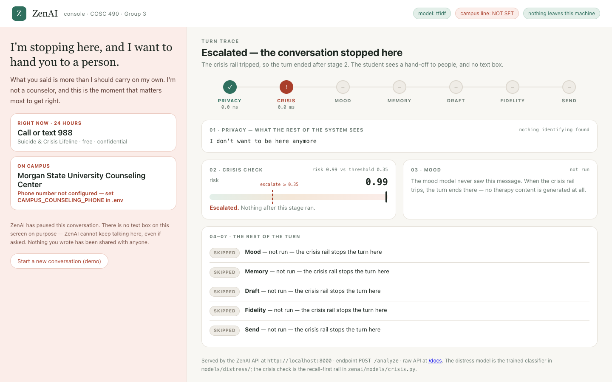

# ZenAI

**An AI counselor that stays inside the protocol.**

COSC 490 — Senior Capstone, Morgan State University, Fall 2026.
Project 5: *"Develop an model for psychological counseling."*
Group 3 — Abraham Irabor · Fnu Soh Tah Fon · Joseph Williams · Chinonso Egeolu

---

## What's in this folder

Everything for ZenAI lives here. Open the files in the left column directly —
the right column is the source they are built from.

| Open this | Built from | What it is |
|---|---|---|
| `presentations/ZenAI-Midterm-Oct15.pptx` | `presentations/midterm-oct15.json` | The Oct 15 deck, 7 slides, **with speaker notes**. Slide 3 carries the rendered architecture diagram. |
| `docs/ZenAI-Build-Plan.docx` | `docs/build-plan.md` | The full plan, Sep 30 → Dec 3 — scope, the three experiments, who owns what, the schedule. |
| `docs/diagrams/*.png` | `docs/diagrams.md` | The four flowcharts as images: architecture, one-turn sequence, data model, timeline. Drop straight into a slide or a report. |
| `docs/ZenAI-Diagrams-Source.docx` | `docs/diagrams.md` | The Mermaid source to paste into Lucidchart. |
| `design/screens.html` | — | The five UI screens. **Double-click to open in a browser.** Also live at `https://zenai-screens.unv.run`. |
| `design/screens-preview.png` | — | The same five screens as one image. |

Then the project itself:

| | |
|---|---|
| `src/zenai/` | The application — agents, API, database models |
| `training/` | The classifiers. **This is the midterm.** |
| `tests/` | What runs in CI |
| `tools/build_deliverables.py` | Rebuilds the .pptx and .docx from their sources |

### Regenerating the documents

Edit the **source** (the `.json` or `.md`), never the `.pptx` or `.docx` —
those are build output and get overwritten.

```bash
pip install python-pptx python-docx
python3 tools/build_deliverables.py
```

### Re-rendering the diagrams

Edit `docs/diagrams.md`, then paste the block into Lucidchart
(Insert → Diagram as code → Mermaid) or re-render to PNG with any Mermaid tool.

---

## The idea

The known failure mode of an LLM counselor is **therapeutic drift**: under
pressure it starts giving advice, reassuring, or quietly diagnosing — the three
things a trained counselor is specifically taught *not* to do. Woebot, Wysa,
Youper, Replika and Ash all control for this with prompt instructions and hope.
None of them score each response against the protocol and refuse to send it when
it drifts. None publish a drift rate, or a crisis-detection recall number.

ZenAI does both. Every candidate reply is scored against the six ACT processes —
acceptance, defusion, present-moment contact, self-as-context, values, committed
action — plus a detector for the three prohibited moves. A reply that drifts is
rejected and regenerated, and every score is logged.

**ZenAI is not a counselor and never claims to be.** It is a support tool that
escalates. The crisis rail runs *before* any therapy content is generated.

## Architecture

Ten agents in four tiers — see `docs/diagrams.md` (Mermaid, paste into Lucidchart).

- **Tier 0 · every turn** — Privacy → Crisis & Safety. Risk detected → escalate, stop.
- **Tier 1 · core loop** — Orchestrator → Mood Check-In → Memory → Conversation → **Fidelity Monitor**
- **Tier 2 · routed** — Academic Stress · Stress-Relief · Wellness Schedule · Resource & Referral
- **Tier 3 · longitudinal** — Progress

## The console

The working frontend. It sends a message through the real pipeline on your
machine and shows each stage of the turn as it runs.

```bash
./setup.sh                                                   # once
PYTHONPATH=src .venv/bin/uvicorn zenai.api.main:app --port 8000
```

Open **http://127.0.0.1:8000**. The raw API is still at `/docs`.

What it shows is exactly what runs, and nothing more. Privacy, the crisis check
and the mood model are live. Memory, the Conversation Agent, the Fidelity
Monitor and sending a reply are drawn in gold as **not built yet** — the API's
`trace` reports them that way, and the console draws the trace. When the crisis
rail trips, every later stage is skipped and the text box disappears.

The header says **campus line: NOT SET** until `CAMPUS_COUNSELING_PHONE` is set
in `.env`. Set it before any demo.



## Running it

**First time on a new machine:** `./setup.sh` — makes the virtualenv, installs
everything (including the two pins that are not optional, see below) and fetches
the training data. Docker not required; works on macOS system Python 3.9.

```bash
cp .env.example .env
docker compose up
curl localhost:8000/health        # {"db":"ok","redis":"ok","models":"..."}
```

API docs: http://localhost:8000/docs — **this is the midterm UI.** No front end
before Oct 15; the rubric says GUI does not count at this stage.

## The models

| | What | Where |
|---|---|---|
| **1 · Distress** | 6-class classifier over GoEmotions + EmpatheticDialogues | `training/train_distress.py` |
| **2 · Crisis** | Risk classifier, **recall-optimised**, lexicon floor | `src/zenai/models/crisis.py` |
| **3 · Fidelity — drift** | Detects advice and reassurance in a candidate reply, sentence by sentence. ESConv, split by conversation: macro-F1 **0.590** vs 0.269 baseline | `training/train_drift.py` |
| **3b · Fidelity — ACT processes** | Scores replies against the six ACT processes; needs the written protocol | — |

> **Two dependency pins that are not optional.** `numpy<2`, because the torch
> wheels that still support Python 3.9 were built against the NumPy 1.x C API and
> NumPy 2 makes every tensor→array call fail with *"Failed to initialize NumPy:
> _ARRAY_API not found"* — which shows up as a **silent exit, not an error**.
> And `accelerate>=0.26`, without which `Trainer` refuses to start. `setup.sh`
> handles both.

```bash
.venv/bin/python -m training.datasets                        # class balance first
.venv/bin/python -m training.train_distress --baseline       # TF-IDF, seconds
.venv/bin/python -m training.train_distress                  # distilroberta, ~15 min CPU
.venv/bin/python -m training.train_distress --no-supplement  # the ablation
.venv/bin/python -m training.train_drift           # the Fidelity Monitor's drift detector
```

**Read `training/taxonomy.py` before training.** Two of the six classes
(`overwhelm`, `isolation`) have no clean GoEmotions source. That is documented,
not hidden, and the supplement that fixes it is a real contribution.

**`training/crisis_threshold.py` makes the argument that carries the grade:** a
missed crisis and a false alarm are not the same error, so the threshold is
chosen by a recall constraint, not by F1 — and we state what precision we paid.

## Who owns what

| | Owns |
|---|---|
| **Chinonso** | Orchestrator · infra · DB · CI · **Fidelity Monitor** |
| **Soh** | Distress classifier · data · eval · Mood Check-In · Progress |
| **Abraham** | **Crisis & Safety** · risk classifier · escalation · Referral |
| **Joseph** | Conversation Agent · **the ACT/CBT protocol & fidelity rubric** · Memory · Privacy |

Branch → PR → one approval → merge. Every artifact carries all four names and a
one-line "who did what" — the course grades individually.

## Before the demo

- [ ] Set `CAMPUS_COUNSELING_PHONE` in `.env` — **verify the real number**
- [ ] Seed the database and cache model outputs so the demo runs offline
- [ ] Use synthetic text for the crisis demo, and say out loud that it is synthetic
