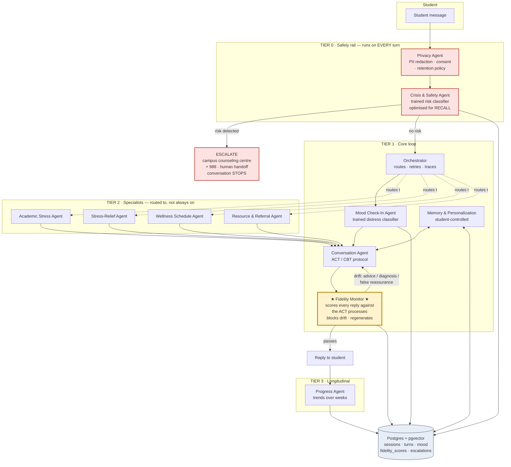
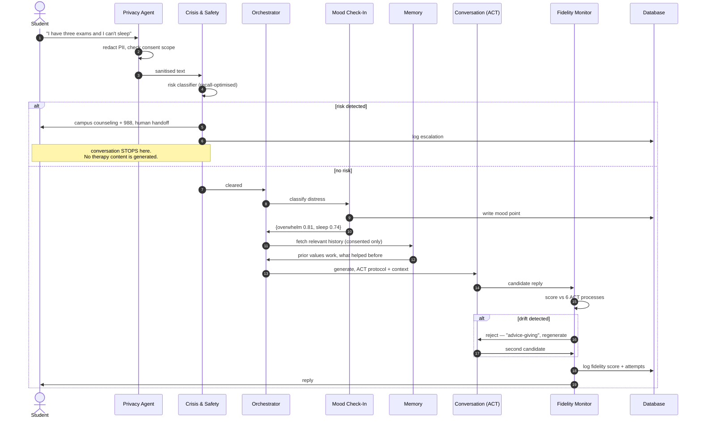
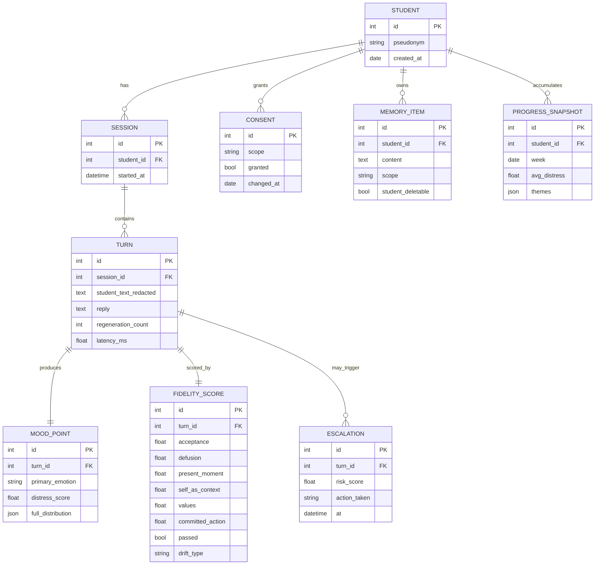
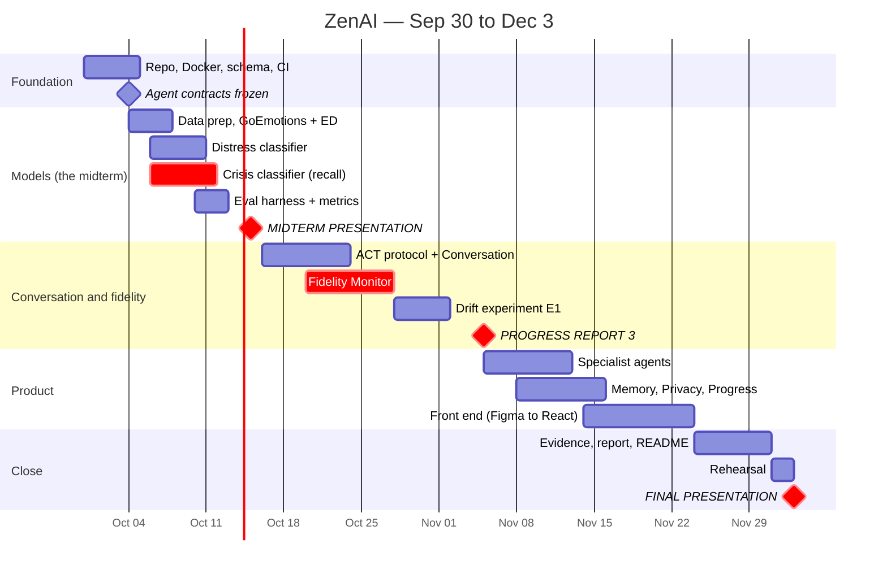

# ZenAI — Lucidchart diagrams

**How to use these.** Lucidchart renders Mermaid natively. In a Lucidchart doc:
**Insert → Diagram as code → Mermaid**, paste one block below, and it draws real
draggable shapes you can restyle. One diagram per Lucid doc (or per page).
Supported types are flowchart, sequence, class, state, C4, gantt and ER — all four
below are inside that set.

Keep these blocks as the source of truth in the repo. When the architecture changes,
edit the code and re-paste rather than dragging boxes around — that's the whole point
of diagram-as-code, and it means the map is never stale at a presentation.

---

## 1 · System architecture — the ten agents, tiered

This is the diagram for slide 3 of every progress report. It keeps all ten agents the
team named in Progress Report 1, but puts them in layers so it's obvious what runs on
every turn, what runs sometimes, and what runs over weeks.

> **The yellow box is the contribution.** Everything else exists in some form in
> Woebot, Wysa, Youper or Ash. The Fidelity Monitor does not.

---

## 2 · One turn, end to end

Use this when someone asks *"but how does it actually work?"* — it answers in one
picture, and it makes the safety-first ordering obvious.

---

## 3 · Data model

---

## 4 · Semester timeline

